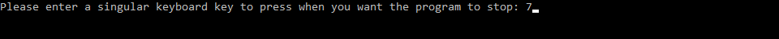
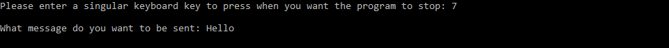
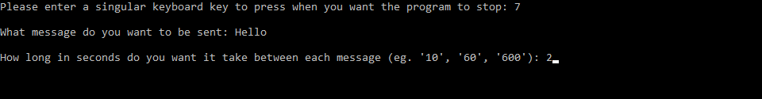
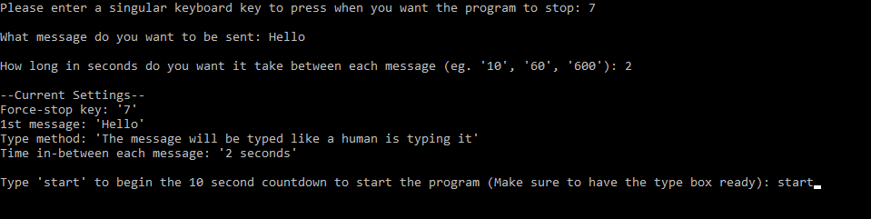
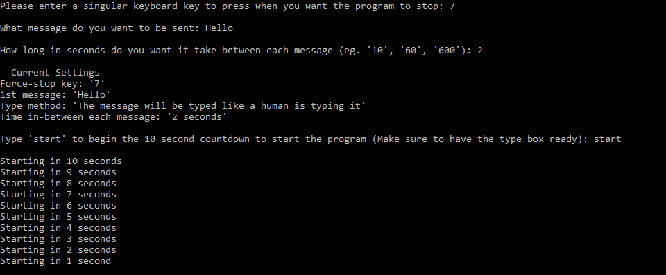
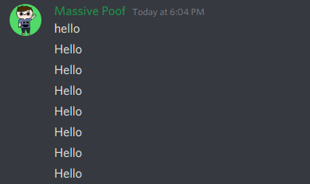
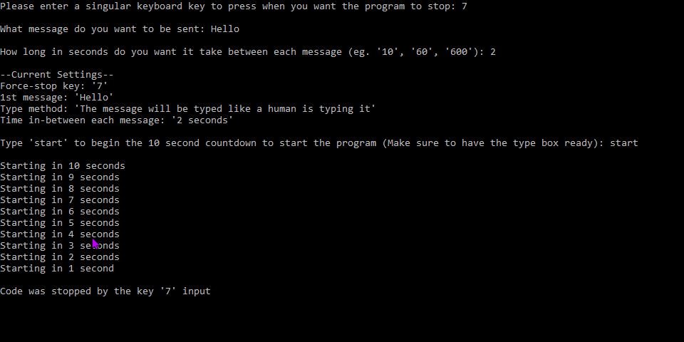
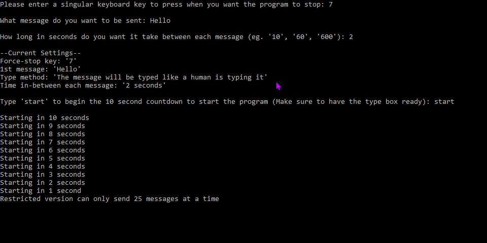

# Message Bot
## This is an .exe file that can help you spam any message into a chatbox.
### This current version is restricted so it can only send 1 chosen message every loop, it will be typed out like a human, The settings cant be changed after set (you have to re-run the program to change the settings, it stops after 25 messages, when stopped you can re-run it without closing it and opening it again.

Step 1) It will ask for you to input a quickstop key so if you want to stop the program from running and cant close the tab then you can press the chosen key to stop it:

Step 2) It will ask for you to type the message you want sent:

Step 3) It will ask for how long you want it to take inbetween each message (in seconds). If you want want to make it 10 minutes then that would be 600 seconds:

Step 4) It will display all the current settings that you wrote previously to ensure you have everything correct before you start the program. Type 'start' when you are ready to start the program:

It will give a 10 second timer to allow you to open the chatbox that the bot will type in:

Once all the steps are completed, the program will start sending the message:

If the key to stop the program is pressed then it will stop and display this:

This version is a restricted version so it will stop after 25 messages and have to be re-run

